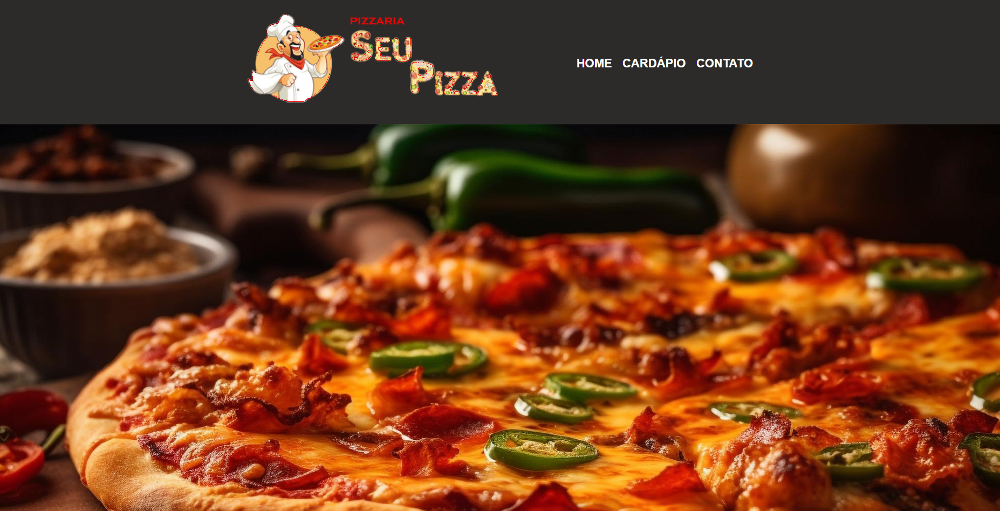

# Pizzaria Seu Pizza

</a>

Repositório criado para fins educacionais e para expôr o projeto feito durante as aulas da matéria de **Desenvolvimento Web** do [**Técnologo de Análise e Desenvolvimento de Sistemas (ADS)**](https://faculdades.sp.senai.br/curso/102901/tecnologo-em-analise-e-desenvolvimento-de-sistemas) da [**Faculdade SENAI SP**](https://faculdades.sp.senai.br).

[**Acesse o site clicando aqui.**](https://joaovtrmorais.github.io/Site_SeuPizza/)

## Objetivo

Aprender a sintaxe básica de HTML, CSS e JavaScript para criação e estilização de páginas Web.

## Técnologias e Ferramentas

